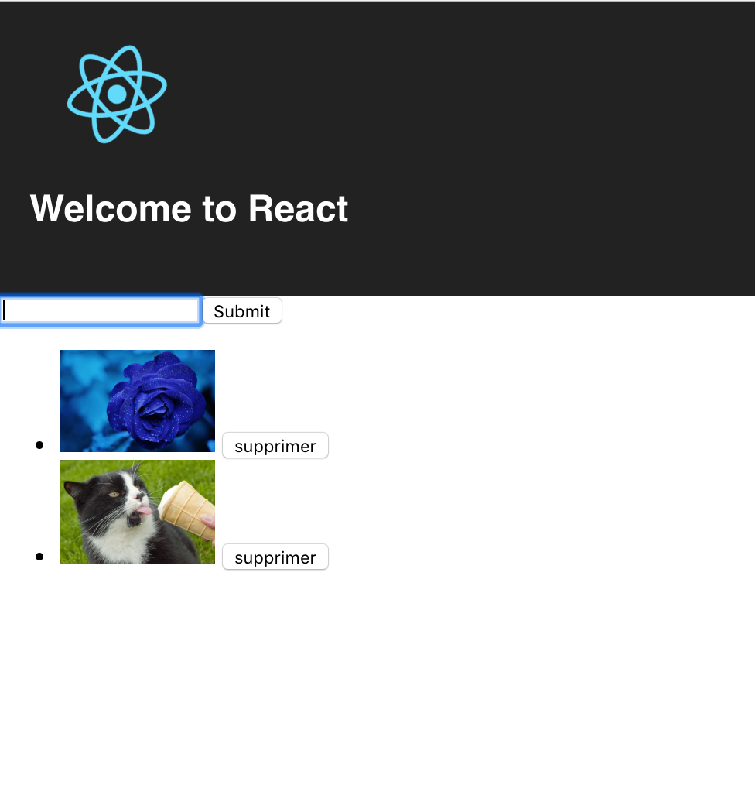

# Web development

## Answer some questions

#### what is HTTP ?

#### what has HTTP to do with web development ?

#### what is a relational database ?

#### how would you query a has_many ?

Imagine an `account` has many `users`. If you have the `account` how do you get back all the `user` of the `account` ?

And how would you query the user's `account` if you have the `user` ?

#### what are primary keys and foreign keys ?

## Write some code ... in react :)

Go into the `react` folder of this project and then run :

- `npm install` (this will install dependencies)
- `npm start` (this will start a webserver)

This app is a simple TODO app. You can add a TODO and delete a TODO. You have to change this code so the TODO are not text anymore but images. For example, if you copy paste this : `https://media.mnn.com/assets/images/2018/07/cat_eating_frozen_treat.jpg.653x0_q80_crop-smart.jpg` in the input, the image should be displayed on the page :

If the input is not a an image, a simple text should be displayed. For example if I input "buy some tomatoes", I wan't to see thee text and not a broken image.

